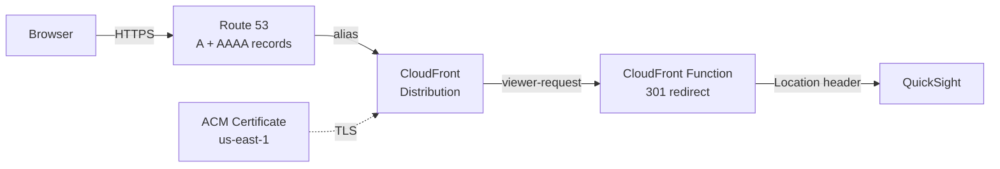

# terraform-aws-quicksight-redirect

A Terraform module that creates friendly vanity URLs for AWS QuickSight using CloudFront, ACM, and Route 53. A single CloudFront distribution handles multiple domain redirects — a CloudFront Function evaluates incoming requests by hostname and returns an HTTP 301 permanent redirect to the appropriate QuickSight instance.

## Architecture



1. Route 53 A and AAAA records alias your custom domains to a single CloudFront distribution (dual-stack IPv4/IPv6).
2. An ACM certificate provides HTTPS for all configured domains.
3. A CloudFront Function intercepts every viewer request and returns a 301 redirect before the request ever reaches an origin.
4. The origin is set to a dummy value (`none.none`) — this is intentional. The CloudFront Function handles all requests so no origin is ever contacted.

## Prerequisites

- [Terraform](https://www.terraform.io/downloads) >= 1.5
- AWS provider >= 5.16.0
- An AWS account with permissions to manage Route 53, CloudFront, and ACM
- An existing Route 53 hosted zone for your domain
- An ACM certificate **in `us-east-1`** covering all domain names you want to redirect (CloudFront is a global service and requires certificates in us-east-1)

## Usage

### Single redirect

```hcl
module "quicksight_redirect" {
  source  = "mcgarrah/quicksight-redirect/aws"
  version = "~> 1.0"

  name_prefix         = "quicksight"
  r53_hosted_zone_id  = "Z1234567890ABC"
  acm_certificate_arn = "arn:aws:acm:us-east-1:123456789012:certificate/12345678-1234-1234-1234-123456789012"

  redirects = {
    "analytics.example.com" = {
      aws_region      = "us-east-1"
      directory_alias = "analytics"
    }
  }
}
```

After deployment, visiting `https://analytics.example.com` returns a 301 redirect to:

```
https://quicksight.aws.amazon.com/?region=us-east-1&directory_alias=analytics
```

### Multiple redirects

A single module instance handles multiple domains through one CloudFront distribution:

```hcl
module "quicksight_redirects" {
  source  = "mcgarrah/quicksight-redirect/aws"
  version = "~> 1.0"

  name_prefix         = "quicksight"
  r53_hosted_zone_id  = var.r53_hosted_zone_id
  acm_certificate_arn = var.acm_certificate_arn

  redirects = {
    "analytics.example.com" = {
      aws_region      = "us-east-1"
      directory_alias = "analytics"
    }
    "reporting.example.com" = {
      aws_region      = "us-west-2"
      directory_alias = "reporting"
    }
  }
}
```

This creates one CloudFront distribution with both domains as aliases. The CloudFront Function routes each hostname to its corresponding QuickSight instance.

### Pinning to a specific version

Using the [Terraform Registry](https://registry.terraform.io/modules/mcgarrah/quicksight-redirect/aws/latest) (recommended):

```hcl
source  = "mcgarrah/quicksight-redirect/aws"
version = "1.0.0"
```

Using the GitHub source directly:

```hcl
source = "github.com/mcgarrah/terraform-aws-quicksight-redirect?ref=v1.0.0"
```

<!-- BEGIN_TF_DOCS -->
### Requirements

| Name | Version |
| ---- | ------- |
| <a name="requirement_terraform"></a> [terraform](#requirement\_terraform) | >= 1.5 |
| <a name="requirement_aws"></a> [aws](#requirement\_aws) | >= 5.16.0 |

### Providers

| Name | Version |
| ---- | ------- |
| <a name="provider_aws"></a> [aws](#provider\_aws) | >= 5.16.0 |

### Resources

| Name | Type |
| ---- | ---- |
| [aws_cloudfront_cache_policy.redirect](https://registry.terraform.io/providers/hashicorp/aws/latest/docs/resources/cloudfront_cache_policy) | resource |
| [aws_cloudfront_distribution.redirect](https://registry.terraform.io/providers/hashicorp/aws/latest/docs/resources/cloudfront_distribution) | resource |
| [aws_cloudfront_function.redirect](https://registry.terraform.io/providers/hashicorp/aws/latest/docs/resources/cloudfront_function) | resource |
| [aws_route53_record.redirect](https://registry.terraform.io/providers/hashicorp/aws/latest/docs/resources/route53_record) | resource |
| [aws_route53_record.redirect_ipv6](https://registry.terraform.io/providers/hashicorp/aws/latest/docs/resources/route53_record) | resource |
| [aws_s3_bucket.access_logs](https://registry.terraform.io/providers/hashicorp/aws/latest/docs/resources/s3_bucket) | resource |
| [aws_s3_bucket_acl.access_logs](https://registry.terraform.io/providers/hashicorp/aws/latest/docs/resources/s3_bucket_acl) | resource |
| [aws_s3_bucket_lifecycle_configuration.access_logs](https://registry.terraform.io/providers/hashicorp/aws/latest/docs/resources/s3_bucket_lifecycle_configuration) | resource |
| [aws_s3_bucket_ownership_controls.access_logs](https://registry.terraform.io/providers/hashicorp/aws/latest/docs/resources/s3_bucket_ownership_controls) | resource |
| [aws_s3_bucket_public_access_block.access_logs](https://registry.terraform.io/providers/hashicorp/aws/latest/docs/resources/s3_bucket_public_access_block) | resource |
| [aws_s3_bucket_server_side_encryption_configuration.access_logs](https://registry.terraform.io/providers/hashicorp/aws/latest/docs/resources/s3_bucket_server_side_encryption_configuration) | resource |

### Inputs

| Name | Description | Type | Default | Required |
| ---- | ----------- | ---- | ------- | :------: |
| <a name="input_acm_certificate_arn"></a> [acm\_certificate\_arn](#input\_acm\_certificate\_arn) | ACM certificate ARN covering all domain names in redirects (must be in us-east-1) | `string` | n/a | yes |
| <a name="input_r53_hosted_zone_id"></a> [r53\_hosted\_zone\_id](#input\_r53\_hosted\_zone\_id) | Route 53 hosted zone ID for the domain | `string` | n/a | yes |
| <a name="input_redirects"></a> [redirects](#input\_redirects) | Map of domain names to QuickSight redirect parameters. Each key is a domain name, and the value specifies the aws\_region and directory\_alias for the redirect URL. | <pre>map(object({<br/>    aws_region      = string<br/>    directory_alias = string<br/>  }))</pre> | n/a | yes |
| <a name="input_access_log_bucket_domain_name"></a> [access\_log\_bucket\_domain\_name](#input\_access\_log\_bucket\_domain\_name) | Regional domain name of an existing S3 bucket for CloudFront access logs (e.g. my-bucket.s3.us-east-1.amazonaws.com). When set, the module skips creating its own bucket. The bucket must have ACLs enabled with BucketOwnerPreferred ownership and the log-delivery-write canned ACL. | `string` | `null` | no |
| <a name="input_access_log_prefix"></a> [access\_log\_prefix](#input\_access\_log\_prefix) | Optional prefix for CloudFront access log file names in the S3 bucket. | `string` | `""` | no |
| <a name="input_enable_access_logging"></a> [enable\_access\_logging](#input\_enable\_access\_logging) | Enable CloudFront standard access logging. When true, uses either the auto-managed S3 bucket or the bucket specified in access\_log\_bucket\_domain\_name. | `bool` | `false` | no |
| <a name="input_name_prefix"></a> [name\_prefix](#input\_name\_prefix) | Prefix for resource names to avoid collisions when using multiple instances of this module | `string` | `"url-redirect"` | no |
| <a name="input_tags"></a> [tags](#input\_tags) | Map of tags to apply to all taggable resources | `map(string)` | `{}` | no |

### Outputs

| Name | Description |
| ---- | ----------- |
| <a name="output_access_log_bucket_arn"></a> [access\_log\_bucket\_arn](#output\_access\_log\_bucket\_arn) | ARN of the S3 bucket for CloudFront access logs (null if logging is disabled or using an external bucket) |
| <a name="output_access_log_bucket_name"></a> [access\_log\_bucket\_name](#output\_access\_log\_bucket\_name) | Name of the S3 bucket for CloudFront access logs (null if logging is disabled or using an external bucket) |
| <a name="output_cloudfront_distribution_id"></a> [cloudfront\_distribution\_id](#output\_cloudfront\_distribution\_id) | The ID of the CloudFront distribution |
| <a name="output_cloudfront_domain_name"></a> [cloudfront\_domain\_name](#output\_cloudfront\_domain\_name) | The domain name of the CloudFront distribution |
| <a name="output_redirect_domains"></a> [redirect\_domains](#output\_redirect\_domains) | List of domain names configured for redirection |
<!-- END_TF_DOCS -->

## How the CloudFront Function Works

The CloudFront Function is written in JavaScript (`cloudfront-js-2.0` runtime) and runs on every viewer request. It inspects the `Host` header and looks up the hostname in a JSON redirect map. Matched hosts return a 301 redirect to the corresponding QuickSight URL. Unmatched hosts redirect to the base QuickSight URL.

For example, given two redirects, Terraform generates:

```javascript
function handler(event) {
    var redirects = {"analytics.example.com":"https://quicksight.aws.amazon.com/?region=us-east-1&directory_alias=analytics","reporting.example.com":"https://quicksight.aws.amazon.com/?region=us-west-2&directory_alias=reporting"};
    var host = event.request.headers.host.value;
    var newurl = redirects[host] || "https://quicksight.aws.amazon.com";

    return {
        statusCode: 301,
        statusDescription: "Moved Permanently",
        headers: { location: { value: newurl } }
    };
}
```

The redirect map is built from the `redirects` variable using `jsonencode()` at deploy time, which safely escapes all values and prevents injection.

## Access Logging

Access logging is disabled by default. When enabled with `enable_access_logging = true`, the module creates and manages an S3 bucket with AES256 encryption, public access blocked, and a 90-day log expiration lifecycle.

For teams that need SSE-KMS encryption, custom lifecycle policies, cross-account log delivery, or centralized logging buckets, the module supports a bring-your-own-bucket model via `access_log_bucket_domain_name`. This is a deliberate design choice — rather than exposing every S3 bucket configuration option as a module variable, the caller creates and configures the bucket externally with full control over encryption, replication, and policies, then passes it to the module.

### Managed bucket (simple)

```hcl
module "quicksight_redirect" {
  source  = "mcgarrah/quicksight-redirect/aws"
  version = "~> 1.0"
  # ...
  enable_access_logging = true
  access_log_prefix     = "quicksight/"
}
```

### External bucket (full control)

```hcl
module "quicksight_redirect" {
  source  = "mcgarrah/quicksight-redirect/aws"
  version = "~> 1.0"
  # ...
  enable_access_logging          = true
  access_log_bucket_domain_name  = aws_s3_bucket.my_log_bucket.bucket_regional_domain_name
  access_log_prefix              = "quicksight/"
}
```

When using an external bucket, it must have ACLs enabled with `BucketOwnerPreferred` object ownership and the `log-delivery-write` canned ACL. See the [CloudFront standard logging documentation](https://docs.aws.amazon.com/AmazonCloudFront/latest/DeveloperGuide/standard-logging-legacy-s3.html) for full requirements.

## Notes

- The ACM certificate must be in `us-east-1` regardless of your deployment region, as CloudFront is a global service.
- The ACM certificate must cover **all** domain names in the `redirects` map (use a wildcard certificate or SANs).
- The dummy origin `none.none` is intentional — the CloudFront Function intercepts all requests before they reach the origin. No traffic is ever sent to this origin.
- The `PriceClass_100` setting limits CloudFront edge locations to North America and Europe to reduce costs.
- This module does **not** declare a provider or backend — the caller is responsible for configuring those.
- Input variables are validated to prevent injection of unsafe characters into the generated JavaScript.

## Examples

See the [examples/quicksight](examples/quicksight) directory for a complete working example.

## Documentation

This README is partially generated by [terraform-docs](https://terraform-docs.io/). The sections between `BEGIN_TF_DOCS` and `END_TF_DOCS` markers are auto-generated from the module source. To regenerate after changing variables, outputs, or resources:

```bash
terraform-docs markdown table --output-file README.md --output-mode inject .
```

## License

MIT
