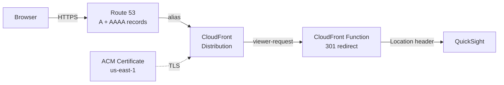

# terraform-aws-quicksight-redirect

A Terraform module that creates friendly vanity URLs for AWS QuickSight using CloudFront, ACM, and Route 53. A single CloudFront distribution handles multiple domain redirects — a CloudFront Function evaluates incoming requests by hostname and returns an HTTP 301 permanent redirect to the appropriate QuickSight instance.

## Architecture



1. Route 53 A and AAAA records alias your custom domains to a single CloudFront distribution (dual-stack IPv4/IPv6).
2. An ACM certificate provides HTTPS for all configured domains.
3. A CloudFront Function intercepts every viewer request and returns a 301 redirect before the request ever reaches an origin.
4. The origin is set to a dummy value (`none.none`) — this is intentional. The CloudFront Function handles all requests so no origin is ever contacted.

## Prerequisites

- [Terraform](https://www.terraform.io/downloads) >= 1.5
- AWS provider >= 5.16.0
- An AWS account with permissions to manage Route 53, CloudFront, and ACM
- An existing Route 53 hosted zone for your domain
- An ACM certificate **in `us-east-1`** covering all domain names you want to redirect (CloudFront is a global service and requires certificates in us-east-1)

## Usage

### Single redirect

```hcl
module "quicksight_redirect" {
  source = "github.com/mcgarrah/terraform-aws-quicksight-redirect"

  name_prefix         = "quicksight"
  r53_hosted_zone_id  = "Z1234567890ABC"
  acm_certificate_arn = "arn:aws:acm:us-east-1:123456789012:certificate/12345678-1234-1234-1234-123456789012"

  redirects = {
    "analytics.example.com" = {
      aws_region      = "us-east-1"
      directory_alias = "analytics"
    }
  }
}
```

After deployment, visiting `https://analytics.example.com` returns a 301 redirect to:

```
https://quicksight.aws.amazon.com/?region=us-east-1&directory_alias=analytics
```

### Multiple redirects

A single module instance handles multiple domains through one CloudFront distribution:

```hcl
module "quicksight_redirects" {
  source = "github.com/mcgarrah/terraform-aws-quicksight-redirect"

  name_prefix         = "quicksight"
  r53_hosted_zone_id  = var.r53_hosted_zone_id
  acm_certificate_arn = var.acm_certificate_arn

  redirects = {
    "analytics.example.com" = {
      aws_region      = "us-east-1"
      directory_alias = "analytics"
    }
    "reporting.example.com" = {
      aws_region      = "us-west-2"
      directory_alias = "reporting"
    }
  }
}
```

This creates one CloudFront distribution with both domains as aliases. The CloudFront Function routes each hostname to its corresponding QuickSight instance.

### Pinning to a version

```hcl
source = "github.com/mcgarrah/terraform-aws-quicksight-redirect?ref=v1.0.0"
```

## Module Inputs

| Variable | Description | Default | Required |
|---|---|---|---|
| `name_prefix` | Prefix for resource names to avoid collisions | `"url-redirect"` | no |
| `r53_hosted_zone_id` | Route 53 hosted zone ID | — | yes |
| `acm_certificate_arn` | ACM certificate ARN (must be in us-east-1) | — | yes |
| `redirects` | Map of domain names to QuickSight redirect parameters (see below) | — | yes |
| `enable_access_logging` | Enable CloudFront standard access logging to an auto-managed S3 bucket | `false` | no |
| `access_log_bucket_domain_name` | Regional domain name of an existing S3 bucket for access logs (overrides auto-managed bucket) | `null` | no |
| `access_log_prefix` | Optional prefix for access log file names in the S3 bucket | `""` | no |
| `tags` | Map of tags to apply to all taggable resources | `{}` | no |

### `redirects` map

Each key is a domain name, and the value is an object with:

| Field | Description | Example |
|---|---|---|
| `aws_region` | AWS region parameter in the QuickSight redirect URL | `"us-east-1"` |
| `directory_alias` | QuickSight directory alias parameter in the redirect URL | `"analytics"` |

## Module Outputs

| Output | Description |
|---|---|
| `cloudfront_distribution_id` | The ID of the CloudFront distribution |
| `cloudfront_domain_name` | The domain name of the CloudFront distribution (e.g. `d111111abcdef8.cloudfront.net`) |
| `redirect_domains` | List of domain names configured for redirection |
| `access_log_bucket_name` | Name of the S3 bucket for CloudFront access logs (null if logging is disabled or using an external bucket) |
| `access_log_bucket_arn` | ARN of the S3 bucket for CloudFront access logs (null if logging is disabled or using an external bucket) |

## How the CloudFront Function Works

The CloudFront Function is written in JavaScript (`cloudfront-js-2.0` runtime) and runs on every viewer request. It inspects the `Host` header and looks up the hostname in a JSON redirect map. Matched hosts return a 301 redirect to the corresponding QuickSight URL. Unmatched hosts redirect to the base QuickSight URL.

For example, given two redirects, Terraform generates:

```javascript
function handler(event) {
    var redirects = {"analytics.example.com":"https://quicksight.aws.amazon.com/?region=us-east-1&directory_alias=analytics","reporting.example.com":"https://quicksight.aws.amazon.com/?region=us-west-2&directory_alias=reporting"};
    var host = event.request.headers.host.value;
    var newurl = redirects[host] || "https://quicksight.aws.amazon.com";

    return {
        statusCode: 301,
        statusDescription: "Moved Permanently",
        headers: { location: { value: newurl } }
    };
}
```

The redirect map is built from the `redirects` variable using `jsonencode()` at deploy time, which safely escapes all values and prevents injection.

## AWS Resources Created

- **Route 53 A and AAAA Records** — One A and one AAAA record per domain, all aliased to the same CloudFront distribution (dual-stack IPv4/IPv6)
- **CloudFront Distribution** — Single distribution hosting the CloudFront Function with a dummy origin (`none.none`)
- **CloudFront Cache Policy** — Forwards the `host` header to enable hostname-based routing in the function
- **CloudFront Function** — JavaScript function that returns 301 redirects based on hostname
- **S3 Bucket** *(optional)* — Created when `enable_access_logging = true` for CloudFront standard access logs, with SSE-AES256 encryption, public access blocked, and 90-day lifecycle expiration

## Access Logging

Access logging is disabled by default. When enabled with `enable_access_logging = true`, the module creates and manages an S3 bucket with AES256 encryption, public access blocked, and a 90-day log expiration lifecycle.

For teams that need SSE-KMS encryption, custom lifecycle policies, cross-account log delivery, or centralized logging buckets, the module supports a bring-your-own-bucket model via `access_log_bucket_domain_name`. This is a deliberate design choice — rather than exposing every S3 bucket configuration option as a module variable, the caller creates and configures the bucket externally with full control over encryption, replication, and policies, then passes it to the module.

### Managed bucket (simple)

```hcl
module "quicksight_redirect" {
  source = "github.com/mcgarrah/terraform-aws-quicksight-redirect"
  # ...
  enable_access_logging = true
  access_log_prefix     = "quicksight/"
}
```

### External bucket (full control)

```hcl
module "quicksight_redirect" {
  source = "github.com/mcgarrah/terraform-aws-quicksight-redirect"
  # ...
  enable_access_logging          = true
  access_log_bucket_domain_name  = aws_s3_bucket.my_log_bucket.bucket_regional_domain_name
  access_log_prefix              = "quicksight/"
}
```

When using an external bucket, it must have ACLs enabled with `BucketOwnerPreferred` object ownership and the `log-delivery-write` canned ACL. See the [CloudFront standard logging documentation](https://docs.aws.amazon.com/AmazonCloudFront/latest/DeveloperGuide/standard-logging-legacy-s3.html) for full requirements.

## Notes

- The ACM certificate must be in `us-east-1` regardless of your deployment region, as CloudFront is a global service.
- The ACM certificate must cover **all** domain names in the `redirects` map (use a wildcard certificate or SANs).
- The dummy origin `none.none` is intentional — the CloudFront Function intercepts all requests before they reach the origin. No traffic is ever sent to this origin.
- The `PriceClass_100` setting limits CloudFront edge locations to North America and Europe to reduce costs.
- This module does **not** declare a provider or backend — the caller is responsible for configuring those.
- Input variables are validated to prevent injection of unsafe characters into the generated JavaScript.

## Examples

See the [examples/quicksight](examples/quicksight) directory for a complete working example.

## License

MIT
